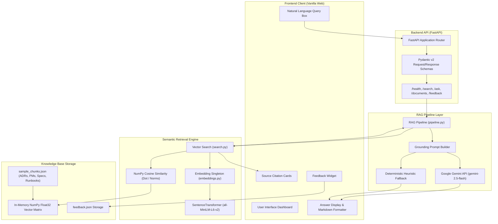

# Archiva AI — System Architecture & Technical Specification

This document provides a comprehensive technical breakdown of the Archiva AI platform architecture, detailing the end-to-end data pipeline, vector retrieval mechanics, retrieval-augmented generation (RAG) orchestration, and frontend-backend interaction.

---

## 1. High-Level Architecture Overview



---

## 2. Data Flow & Sequence Diagram

```mermaid
sequenceDiagram
    autonumber
    actor Engineer as Software Engineer
    participant Frontend as Browser UI
    participant FastAPI as FastAPI Server
    participant Pipeline as RAG Pipeline
    participant Search as Search & Embeddings
    participant LLM as Gemini API / Fallback

    Engineer->>Frontend: Enters query ("Have we solved duplicate payment processing before?")
    Frontend->>FastAPI: POST /ask { "query": "..." }
    FastAPI->>Pipeline: answer_question(query)
    
    rect rgb(20, 30, 45)
    Note over Pipeline,Search: Step 1: Semantic Retrieval
    Pipeline->>Search: search(query, top_k=5)
    Search->>Search: Encode query -> 384d vector
    Search->>Search: Compute Cosine Similarity against cached chunk matrix
    Search->>Search: Rank and filter top chunks
    Search-->>Pipeline: Return top ranked chunks with metadata
    end

    rect rgb(30, 25, 45)
    Note over Pipeline,LLM: Step 2: Grounded Answer Synthesis
    Pipeline->>Pipeline: build_rag_prompt(query, chunks)
    alt GEMINI_API_KEY is configured
        Pipeline->>LLM: Generate content with strict grounding
        LLM-->>Pipeline: Return synthesized answer
    else Missing key or API error
        Pipeline->>LLM: generate_deterministic_fallback(query, chunks)
        LLM-->>Pipeline: Return structured summary citing ADRs/PMs
    end
    end

    Pipeline-->>FastAPI: { "question", "answer", "sources" }
    FastAPI-->>Frontend: HTTP 200 JSON
    Frontend->>Engineer: Renders formatted answer & interactive source citation cards
    
    opt User Feedback
    Engineer->>Frontend: Clicks 👍 Yes / 👎 No + Comment
    Frontend->>FastAPI: POST /feedback { "query", "helpful", "comment" }
    FastAPI->>FastAPI: Append to feedback.json
    FastAPI-->>Frontend: HTTP 200 { "status": "success" }
    end
```



---

## 3. Core Component Deep Dive

### 3.1 Document Ingestion & Chunking
Each document in Archiva AI is partitioned into cohesive, self-contained semantic units following this structured JSON schema:

```json
{
  "chunk_id": "adr-001-01",
  "document_id": "ADR-001",
  "title": "Payment Idempotency",
  "document_type": "ADR",
  "content": "We introduced idempotency keys across all payment endpoints to prevent duplicate transactions...",
  "team": "Payments",
  "service": "Payment Service"
}
```

### 3.2 Embedding Generation (`embeddings.py`)
- **Model**: `sentence-transformers/all-MiniLM-L6-v2`
- **Output Dimensionality**: 384 dimensions (dense real-valued vectors)
- **Lifecycle**: Lazy-loaded module singleton initialized during FastAPI lifespan startup to ensure zero repeated model loads.
- **Batch Processing**: Supports both `generate_embedding(text)` and vectorized `generate_embeddings(texts)`.

### 3.3 Semantic Retrieval & Cosine Similarity (`search.py`)
Cosine similarity evaluates the angular difference between the query vector $q$ and each chunk vector $d_i$:

$$\text{Cosine Similarity}(q, d_i) = \frac{q \cdot d_i}{\|q\|_2 \times \|d_i\|_2} = \frac{\sum_{j=1}^{384} q_j d_{ij}}{\sqrt{\sum_{j=1}^{384} q_j^2} \sqrt{\sum_{j=1}^{384} d_{ij}^2}}$$

- **Vectorized Matrix Acceleration**: Stored chunk embeddings are maintained in a 2D NumPy array matrix $(N \times 384)$.
- **Complexity**: $O(N \times 384)$ per search request, achieving sub-millisecond query evaluation.

### 3.4 Context Grounding & Prompt Engineering
The RAG pipeline constructs an explicit grounding prompt preventing the language model from hallucinating technical details:

```
You are Archiva AI, an engineering knowledge assistant.
Answer the engineer's question using only the supplied engineering knowledge.
If the supplied knowledge does not contain enough information, say that the available engineering knowledge does not provide enough evidence.
Do not invent incidents, decisions, dates, teams, or technical solutions.
Mention which sources support the answer.

=== RETRIEVED ENGINEERING KNOWLEDGE ===
[1] Source: ADR-001 — Payment Idempotency (ADR)
Team: Payments | Service: Payment Service
Content: We introduced idempotency keys...

=== ENGINEER'S QUESTION ===
Have we solved duplicate payment processing before?
```

### 3.5 LLM Integration with Deterministic Heuristic Fallback
- **Primary Generator**: Google Gemini (`gemini-2.5-flash` / `gemini-1.5-flash`).
- **Offline Fallback Engine**: If no API key is provided or if network calls encounter errors/timeouts, the engine synthetically groups and summarizes retrieved chunks categorized by document type (Postmortem, ADR, Runbook, Design Spec) and automatically structures source citations.

---

## 4. Frontend Design & Interaction
- **Technology**: Vanilla HTML5, modern CSS3 with custom CSS variables, and asynchronous ES6 JavaScript.
- **Aesthetic**: Developer-first dark slate palette with glowing accents and color-coded badges:
  - `ADR`: Cyan
  - `Postmortem`: Rose/Amber
  - `Design Spec`: Purple
  - `Runbook`: Emerald
- **Interactive Capabilities**:
  - Live backend health indicator.
  - One-click suggested query chips.
  - Grounded answer vs. raw vector search mode toggling.
  - Interactive Knowledge Base repository browser modal.
  - In-place user feedback submission.
